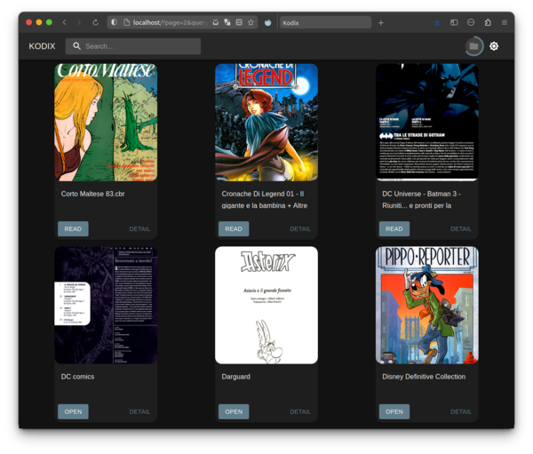

# Kodics
Like a plex server for comics and books, written in Laravel & React, served as a docker container.
Kodics scrape your comics & ebooks collection and serve your favourite contents directly in your browser.
The currently supported file types are cbr, cbz, pdf and ebpub.
This is a beta version of the project, so is expected to there are minor bugs.

<p align="center">
  
</p>


## Usage
Run with docker cli:
```
docker run -d
  -p 80:80 
  -v <local-comics-folder>:/comics:ro 
  [-v <config-folder>:/app/storage ]
  rickrk4/kodics
```

Run with docker-compose
```
kodics: 
  image: rickrk4/kodics
  ports: 
    - 80:80 
  volumes:
    - "<local-comics-folder>:/comics:ro"
    - "<config-folder>:/app/storage" #OPTIONAL
  restart: unless-stopped
```

## How to build the container
```
git clone https://github.com/rickrk4/kodics && cd kodics
docker build -t kodics .
```